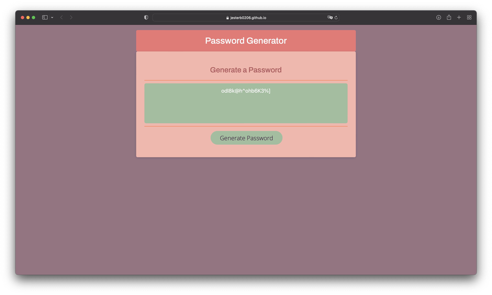

# JavaScript Password Generator

## Description

So far, in my journey as a beginner web developer, I've developed static webpages/websites that have run on only HTML and CSS. This week I wanted to change that, and create a web application that featured dynamically updated HTML and CSS powered by JavaScript code. If you do a simple search of random password generators on Google almost 34,000,000 results are found. My motivation, then, wasn't to create something that hadn't been done before, but rather, to practice new concepts I learned in Boot Camp like for loops and arrays, all the while ensuring that my web application had a visually appealing user interface that was easy to use. This web application is useful for anyone that wants to ensure that their accounts can't easily be accessed by nefarious individuals, who want to see their confidential information without their consent. I'm grateful for choosing to build this web application as it gave me the chance to further learn about for loops and arrays, as I mentioned before, but also because I got to practice writing else if statements, functions, etc.

## Usage

A few things to note:

- To generate a password, hover over the button that says "Generate Password" and right click it with your mouse (you'll notice that when you hover over the button it changes color and the words "Generate Password" also change color).
- A window will pop up that says "How many characters do you want your password to be?" Say you enter something that isn't a number, like the word cow. An alert will pop up on the screen that says "Please enter a number!" Also, if you don't enter a number between 8 and 128 another alert will pop up on the screen, this time saying "Invalid password length. The password length should be between 8 and 128 characters." If you enter a decimal number it will round down to the nearest integer, even if you entered say 9.99.
- You'll then be asked if would like to include numbers, special characters, lowercase letters and uppercase letters in your password. If you click cancel for all of the prompts a random password will be generated that only includes special characters. Otherwise, a password with the conditions you chose will be randomly generated.

https://jesterb0206.github.io/javascript-password-generator/

## Credits

My JavaScript Password Generator wouldn't have been visually appealing if it wasn't for these websites that I drew my CSS style ideas from:

https://www.color-hex.com/color-palette/1011031 - violets and roses Color Palette 

https://artisanthemes.io/best-google-fonts-combinations-modern-agency-website/ - Best Google Fonts Combinations for a Modern Website (Including Color Palettes!) [I used Google Fonts combination 6, Archivo + Open Sans]

https://fonts.google.com - Google Fonts

## License

[This application is under the MIT license](https://opensource.org/licenses/MIT)
